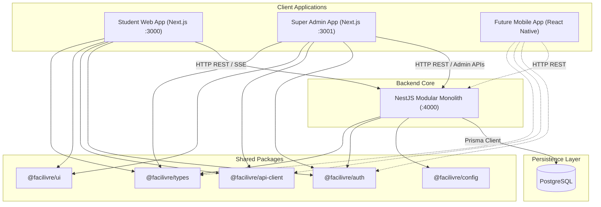

# FaciLivre System Architecture Overview

## 1. Monorepo Topology

## 2. Port Allocation
- **Student Portal**: `http://localhost:3000`
- **Super Admin Dashboard**: `http://localhost:3001`
- **NestJS API Core**: `http://localhost:4000`

## 3. Core Principles
1. **Modular Monolith**: Clean boundaries between domain modules (`auth`, `users`, `content`, `feed`, `quizzes`, `study`, `admin`) to simplify early-stage development while ensuring future service extractability.
2. **API Isolation**: Zero direct frontend connection to PostgreSQL. All persistence operations are routed through NestJS controllers, services, and repositories.
3. **Bandwidth Optimization**: Lightweight payload structures, modular tree-shaking, and lazy loading strategies designed for low-bandwidth environments.
