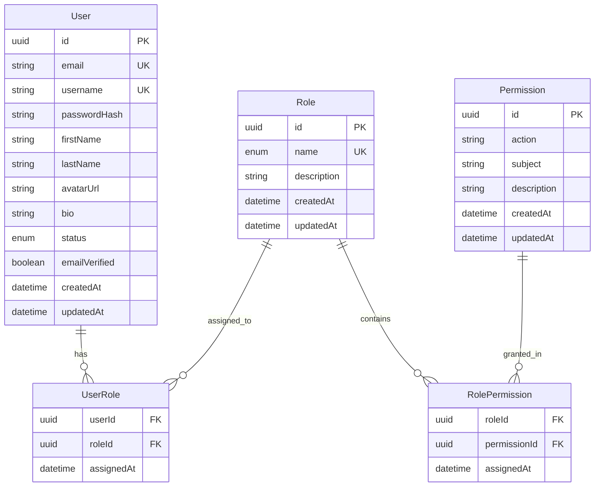

# FaciLivre Database & Identity Schema

## 1. Conceptual ERD

## 2. Default Roles
- `STUDENT`: Default platform user with access to consume content, participate in study rooms, take quizzes, like/comment/follow.
- `CREATOR`: Verified student or educator authorized to publish micro-learning videos and educational posts.
- `TEACHER`: Verified academic instructor with course curation and quiz authoring privileges.
- `MODERATOR`: Platform safety operator with report triage and content moderation capabilities.
- `ADMIN`: Administrator managing platform entities, categories, and creators.
- `SUPER_ADMIN`: Full system governance, settings, user role elevation, and audit log inspection.
